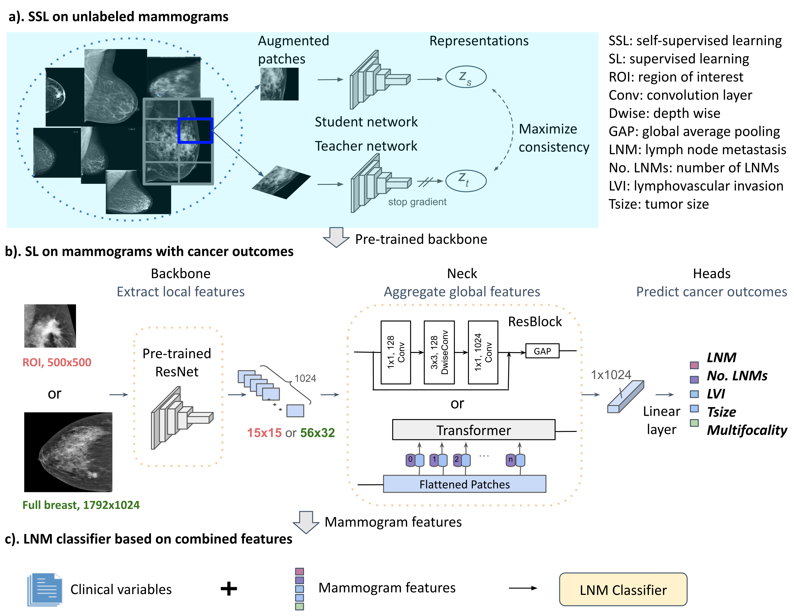

# Deep learning on Mammograms
In this folder, we implemented mammography DL pipelines under the open-mmlab MMPreTrain framework. This work is published in npj digital medicine and is available [here](https://doi.org/10.1038/s41746-025-01831-8)
## Deep learning on routine full-breast mammograms enhances lymph node metastasis prediction in early breast cancer
In this study, we developed and validated DL models based on preoperatively available clinicopathological predictors and full-breast digital mammogram features to predict LNM status and comprehensively evaluated the added value of routine mammograms to preoperatively predict LNM in multicenter cohorts of cN0 T1–T2 breast cancer patients having primary surgery. The results demonstrate that advances in DL techniques, including domain-adaptive pretraining through SSL and sophisticated spatial modeling empowered by a Transformer, significantly improve imaging analysis, particularly for full-breast mammograms. Our findings reveal that routine mammograms can substantially enhance the preoperative diagnosis of LNM in early-stage breast cancer, and are as informative as key postoperative pathological indicators, such as tumor size and multifocality. Notably, full-breast mammograms exhibited overall comparable predictive performance to tumor region-focused models and showed favorable discriminating ability in the independent test set, underscoring its clinical applicability. 


## Getting Started

To get a local copy up and running, follow steps below to train and test the DL models

### Prerequisites

python 3.8.18, check environment.yml for needed packages. The listed lib-verions have been tested on CUDA version 12.

### Installation

1.Clone the repo

```git clone https://github.com/dorazhang93/Mammography-nils.git```

2.Create conda environment

```conda env create --name VIR_ENV_NAME --file=environment.yml --force```

### Activate the created conda environment

```conda activate VIR_ENV_NAME```

```cd Mammography-nils```

## Usage
### Prepare mammogram images in png format and construct meta file (.json) linking image path (png) and clincal variables and ground-truth labels.
Prepare unlabeled mammogram patches for self-supervised learning, and single- or multi-task labeled ROIs or full-breast mammograms for supervised learning. Dataloader API reused the open mmlab design with minor changes to load images, clinical variables and labels. Source code is under the folder -- "dataset/". To use this dataloader, you need to prepare mammograms in png format. *** Important! Applying tight bounding boxes to crop out large background area would increase predictions on small breasts.***
Detailed preprocessing and augmetation parameters are available in the publication.
An example for meta file (.json):
```
{
          "metainfo": {
            "tasks":
              [
              'Tumor size',
              'LNM'
              ]
          },
          "data_list": [
            {
              "img_path": "a.jpg",
              gt_label:{
                  "Tumor size": 0.765,
                  "LNM": 0
                }
            },
            {
              "img_path": "b.jpg",
              gt_label:{
                  "Tumor size": 0.2,
                  "LNM": 1
                }
            }
          ]
        }
```

### Train DL models in 3 steps
#### Self-supervised training on unlabeled mammogram patches
Configuration files setting up data pipeline, model and training hyperparameters for the three state-of-the-art SSL algorithms were placed under the folder -- configs/pretrain

An example to run the BarlowTwins algorithm using 2 GPUs with mixed-precsion mode for efficient training :
```
bash tools/dist_train.sh configs/pretrain/barlowtwins_resnet50-exp2_-coslr-100e_MMpatches.py 2 --amp > barlowtwins.log
```
#### Supervised training on labeled mammograms with cancer outcomes

Configuration files setting up data pipeline, model and training hyperparameters for supervised training on multi-task mammograms of full-breast and ROIs were given under the folder configs/multi_task_SL.

An example to run SL on full-breast images using Transformer neck and ResNet backbone pretrained with BarlowTwins SSL:
```
python projects/Mammography/tools/train.py projects/Mammography/configs/multi_task_SL/fullimage1792x1024_resnet50-expan2_barlowtwin_finetune_transformer_Aug3.py \
      --work-dir ${out_dir} \
      --cfg-options default_hooks.checkpoint.out_dir=${ckpt_dir} \
      train_dataloader.dataset.data_root=${data_root} \
      val_dataloader.dataset.data_root=${data_root} \
      test_dataloader.dataset.data_root=${data_root} \
      train_dataloader.dataset.ann_file=${anno_subfolder}/train.json \
      val_dataloader.dataset.ann_file=${anno_subfolder}/val.json \
      test_dataloader.dataset.ann_file=${anno_subfolder}/meta/test.json
```

#### Combining mammogram features and clinical variables
Definitions of clinical variables will be attached.
```
python projects/Mammography/mlp.py --data-root ${data_root} --mode "clinical-mammo" \
          --work-dir ${out_dir} >${out_dir}/out.log
```
### Evaluate DL piplines

To evaluate trained model:
```
python tools/test.py projects/Mammography/configs/${EXP}.py ${best_ckpt} --work-dir work_dirs_test/ --out ${out_dir}/test/best_rd${r2}.json --out-item metrics
```
To run mammogram features using trained model:
```
python tools/test.py projects/Mammography/configs/${EXP}.py ${best_ckpt} --work-dir work_dirs_test/ --out ${out_dir}/test/best_rd${r2}.pkl --out-item pred
```
